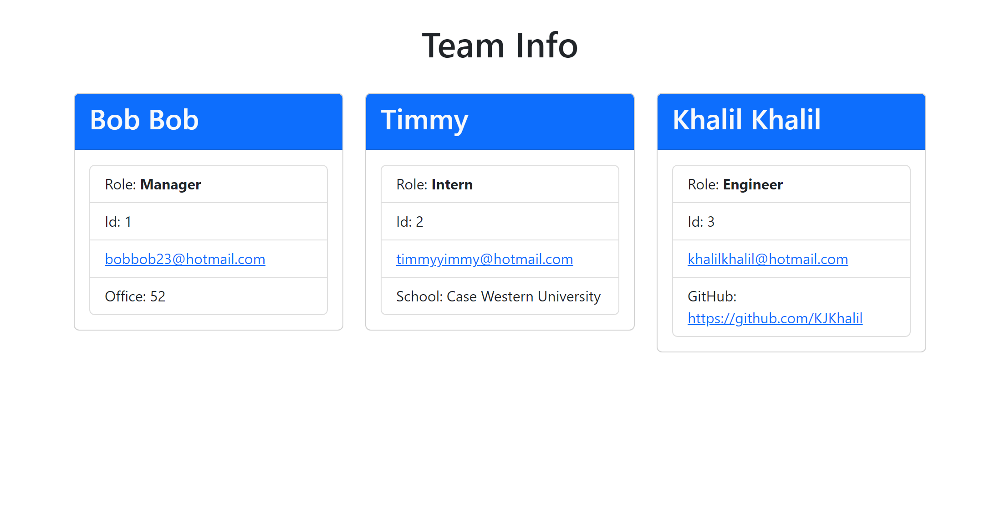

# Team-Profile-Generator

  

  ## Table Of Contents
  * [Description](#description)
  * [Installation](#installation)
  * [Usage](#usage)
  * [Contribution](#contribution)
  * [Test](#test)
  * [License](#license)
  * [Question(s)](#questions)

  ## Description
  An app using Node.js command line to take information given to the app to create a custom team profile.

  ## Installation
  You'll need to install node, inquirer, and also jest if you want to test it.

  ## Usage
  You'll run it through node using the command node index.js Here is a Walkthrough Video: (https://drive.google.com/file/d/1VgfX1A0ry-yLQGsboArBFjuLqT6UD-TM/view)

  ## Contribution
  N/A

  ## Test
  You'll install jest and then use the command npm test in terminal or hit debug in package.json.

  ## License
  https://opensource.org/licenses/ISC

  ## Question(s)
  If you have any questions about this project you can reach me at:
  * GitHub: https://github.com/KJKhalil
  * Email: khalil.j.khalil@hotmail.com
